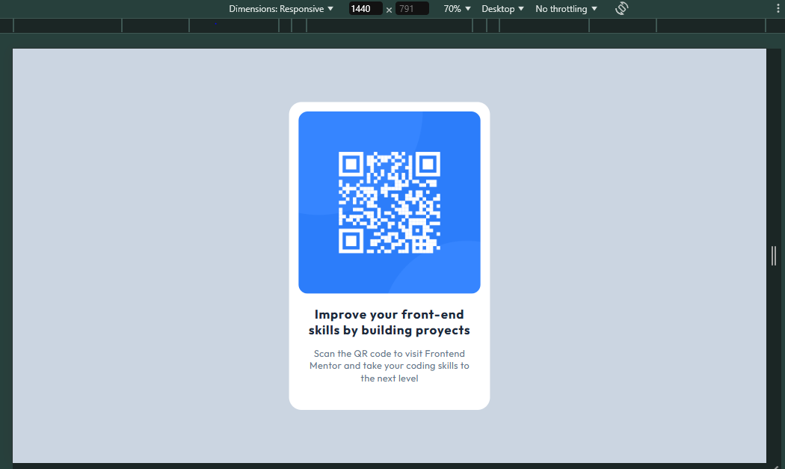
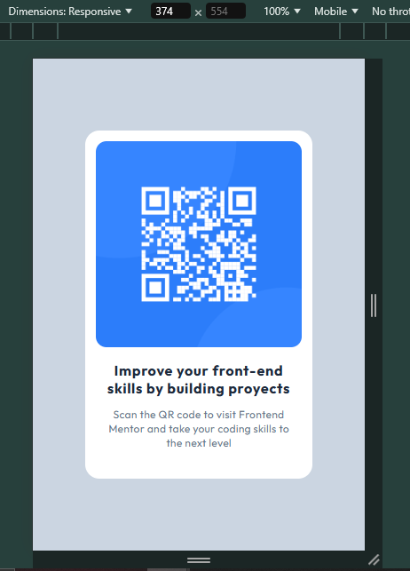

# Frontend Mentor - QR code component solution

This is a solution to the [QR code component challenge on Frontend Mentor](https://www.frontendmentor.io/challenges/qr-code-component-iux_sIO_H). Frontend Mentor challenges help you improve your coding skills by building realistic projects.

## Table of contents

- [Overview](#overview)
  - [Screenshot](#screenshot)
  - [Links](#links)
- [My process](#my-process)
  - [Built with](#built-with)
  - [What I learned](#what-i-learned)
  - [Continued development](#continued-development)
- [Author](#author)

## Overview

### Screenshot

#### Desktop



#### Mobile



### Links

- Live Site URL: [Click here to see the solution](https://frontend-mentor-num-1-qr-code.netlify.app/)

## My process

### Built with

- Semantic HTML5 markup
- Mobile-first workflow
- [Tailwind CSS](https://tailwindcss.com/) - For styles

### What I learned

The main goal of this challenge was without doubt, learn and put in practice TAILWIND CSS!. It's amazing how you can rapidly style you project through the utility classes. Fantastic.

For example: Due to Tailwind has a mobile-first approach, I created my own customs breakpoints: "tablet" and "desktop". In that way, the styles will only be applied when the screen take the size I configured in the tailwind.config.js file, as below

```html

```

```js
theme: {
    extend: {
      screens: {
        tablet: "640px",
        desktop: "1440px",
      },
      fontFamily: { Outfit: ["Outfit", "sans-sefir"] },
    },
  },
```

### Continued development

My next steps will be to dive deeper into Tailwind and Typescript!

## Author

- Frontend Mentor - [@EdelmiroAnton](https://www.frontendmentor.io/profile/EdelmiroAnton)
- Linkedin - [@EdelmiroAnton](https://www.linkedin.com/in/edelmiro-anton/)
